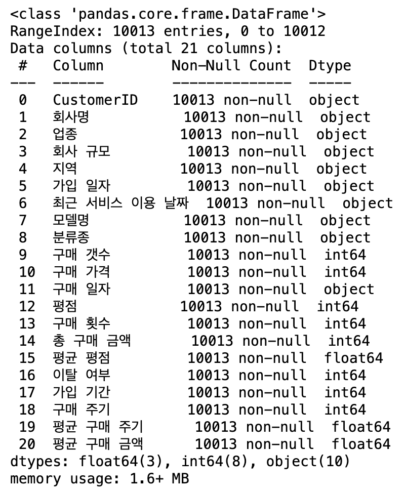

# SKN08-2nd-3Team
SK Networks AI 8기 2번째 단위 프로젝트입니다.

<div align="center">
  

   

  [](https://hits.seeyoufarm.com)
</div>


# 1. Introduction Team (팀 소개)
### ✅ 팀명 : MASHED-PHOTATO
<table align=center>
  <tbody>
    <tr>
      <td align=center><b>유제나</b></td>
      <td align=center><b>조준희</b></td>
      <td align=center><b>주고은</b></td>
      <td align=center><b>최병준</b></td>
    </tr>
    <tr>
      <td align="center">
        <div>
          
        </div>
      </td>
      <td align="center">
        <div>
          
        </div>
      </td>
      <td align="center">
        <div>
          
        </div>
      </td>
      <td align="center">
        
      </td>
    </tr>
    <tr>
      <td><a href="https://github.com/denalog"><div align=center>@denalog</div></a></td>
      <td><a href="https://github.com/CodeLego8"><div align=center>@CodeLego8</div></a></td>
      <td><a href="https://github.com/Goeun-Ju"><div align=center>@Goeun-Ju</div></a></td>
      <td><a href="https://github.com/ChoiByuengJun"><div align=center>@ChoiByuengJun</div></a></td>
    </tr>
  </tbody>
</table>
<br><br><br>


# 2. 📍Introduction Project📍 (프로젝트 개요)

### ✅프로젝트 명
자동차 판매사이트의 고객 이탈 여부 데이터 분석 및 개선 방안 제안

### ✅프로젝트 소개
자동차 판매 사이트에서 고객의 구매 데이터를 분석하고, 고객 이탈 여부를 예측하는 프로젝트입니다.
고객 행동 데이터를 기반으로 데이터 전처리, 클러스터링, 차원 축소 및 시각화를 통해 고객의 특성과 이탈 가능성을 파악하는 것을 목표로 하며,
이를 통해 효율적인 마케팅 전략을 수립하고, 고객 유치율을 높이고자합니다.


### ✅프로젝트 필요성(배경)
1. **고객 이탈 문제의 중요성**  
   - 자동차 판매 시장에서 기존 고객의 이탈은 신규 고객을 유치하는 것보다 더 큰 비용을 초래합니다.
   - 고객 이탈 예측을 통해 기업은 사전에 대응하여 충성 고객을 유지할 수 있습니다.

2. **데이터 기반 의사결정의 필요성**  
   - 데이터 분석과 예측 모델링을 통해 고객 행동을 이해하고, 이를 바탕으로 효과적인 비즈니스 전략을 수립할 수 있습니다.
   - 정제된 데이터를 기반으로 한 클러스터링과 시각화는 고객 세분화 및 맞춤형 마케팅 전략 개발에 필수적입니다.

3. **효율적 자원 관리**  
   - 고객 행동 데이터를 분석하여 마케팅 자원을 효율적으로 배분하고, 이탈 가능성이 높은 고객에게 집중 투자할 수 있습니다.

### ✅프로젝트 목표
1. **데이터 전처리 및 분석 능력 강화**  
   - Python을 사용한 데이터 정제 및 가공.
   - Feature Engineering 기법을 통해 데이터의 품질을 개선하고 분석 가능성을 확대.

2. **효율적인 클러스터링 및 차원 축소**  
   - K-Means 클러스터링을 활용하여 고객을 유사한 그룹으로 분류.
   - PCA(Principal Component Analysis)를 통해 데이터를 시각화하고 차원을 축소하여 주요 특징을 파악.

3. **고객 이탈 예측 모델 개발**  
   - 고객 행동 데이터를 기반으로 한 이탈 여부 예측.
   - 분석 결과를 통해 고객 이탈 가능성을 시각화하고 이해하기 쉽게 전달.

4. **최종 목표**  
   - 고객 이탈 가능성에 따라 맞춤형 마케팅 전략을 제안.
   - 분석 결과를 기반으로 한 데이터 중심 의사결정 지원.
<br><br><br>


# 3. Tech Stack (기술 스택)

>### <span style="color:cyan"> Co-Work Tool </span>
<table>
  <tr>
    <td>Communication & Messenger</td>
    <td></td>
    <td></td>
    <td></td>
  </tr>
  <tr>
    <td>Development & Merge</td>
    <td></td>
    <td></td>
    <td></td>
  </tr>  
</table>


>### <span style="color:cyan"> Data Server </span>
<table>
  <tr>
    <td>PyCharm</td>
    <td></td>
    <td></td>
  </tr>  
  <tr>
    <td>RDBMS</td>
    <td></td>
    <td></td>
    <td></td>
  </tr>
</table>
<br><br><br>


# 4. 📈 활용 데이터셋

## Faker로 만든 더미데이터
```c
import random
from faker import Faker
import pandas as pd

# Faker 인스턴스 생성
fake = Faker()

# 업종 및 회사 규모
industries = [
    "렌터카 업체", "택시회사", "물류/운송회사", "중고차 딜러",
    "운전학원", "라이드 셰어링/카풀 서비스 기업",
    "공유 차량 서비스 기업", "정부 및 공공기관",
    "건설/산업 장비 대여 업체", "소규모 물품 배달 서비스 회사"
]

company_sizes = ["소기업", "중소기업", "중견기업", "대기업"]

locations = [
    "서울특별시", "부산광역시", "대구광역시", "인천광역시", "광주광역시",
    "대전광역시", "울산광역시", "세종특별자치시", "경기도", "충청북도",
    "충청남도", "전라남도", "경상북도", "경상남도", "강원특별자치도",
    "전북특별자치도", "제주특별자치도"
]

vehicle_data = {
    "스텔라 세단": {"분류종": "승용차 및 SUV", "가격": 45000000},
    "네오 SUV": {"분류종": "승용차 및 SUV", "가격": 55000000},
    "사이버 트럭": {"분류종": "상용차 및 픽업트럭", "가격": 60000000},
    "오로라 미니버스": {"분류종": "버스 및 대형", "가격": 75000000},
    "퓨전 일렉트릭 버스": {"분류종": "버스 및 대형", "가격": 120000000},
    "펄스 컴팩트카": {"분류종": "승용차 및 SUV", "가격": 25000000},
    "루미너스 리무진": {"분류종": "승용차 및 SUV", "가격": 90000000},
    "솔라 SUV": {"분류종": "승용차 및 SUV", "가격": 50000000},
    "타이탄 카고 트럭": {"분류종": "상용차 및 픽업트럭", "가격": 70000000},
    "에스트라 세단": {"분류종": "승용차 및 SUV", "가격": 65000000},
    "제타 컴팩트카": {"분류종": "승용차 및 SUV", "가격": 20000000},
    "오메가 컴팩트카": {"분류종": "승용차 및 SUV", "가격": 23000000}
}

domains = ["naver.com", "daum.net", "gmail.com", "hanmail.net", "kakao.com"]

# 업종 및 회사 규모에 따른 차량 구매 조건 정의
def get_vehicle_preferences(industry, company_size):
    if industry in ["렌터카 업체", "택시회사", "라이드 셰어링/카풀 서비스 기업"]:
        vehicle_types = ["승용차 및 SUV"]
    elif industry in ["물류/운송회사", "건설/산업 장비 대여 업체"]:
        vehicle_types = ["상용차 및 픽업트럭"]
    elif industry in ["정부 및 공공기관", "소규모 물품 배달 서비스 회사"]:
        vehicle_types = ["버스 및 대형", "승용차 및 SUV"]
    else:
        vehicle_types = ["승용차 및 SUV", "상용차 및 픽업트럭"]

    vehicle_count = {
        "소기업": random.randint(1, 3),
        "중소기업": random.randint(3, 7),
        "중견기업": random.randint(7, 15),
        "대기업": random.randint(15, 30)
    }[company_size]

    return vehicle_types, vehicle_count

# 고객 데이터 생성 함수
def generate_customer_data(num_customers):
    purchase_history = []

    for customer_id in range(1, num_customers + 1):
        name = fake.company()
        industry = random.choice(industries)
        company_size = random.choice(company_sizes)
        location = random.choice(locations)
        signup_date = fake.date_between(start_date='-5y', end_date='-1y')
        last_service_date = fake.date_between(start_date=signup_date, end_date='today')
        vehicle_types, vehicle_count = get_vehicle_preferences(industry, company_size)
        selected_vehicles = random.choices(
            [model for model, details in vehicle_data.items() if details["분류종"] in vehicle_types],
            k=vehicle_count
        )
        email = f"customer{customer_id}@{random.choice(domains)}"

        # 구매 이력 데이터 생성
        for vehicle in selected_vehicles:
            quantity = random.randint(1, 5)
            purchase_history.append({
                "CustomerID": email,
                "회사명": name,
                "업종": industry,
                "회사 규모": company_size,
                "지역": location,
                "가입 일자": signup_date,
                "최근 서비스 이용 날짜": last_service_date,
                "모델명": vehicle,
                "분류종": vehicle_data[vehicle]["분류종"],  # 분류종 추가
                "구매 갯수": quantity,
                "구매 가격": vehicle_data[vehicle]["가격"] * quantity,
                "구매 일자": fake.date_between(start_date=signup_date, end_date=last_service_date),
                "평점": random.randint(1, 5)
            })

    return purchase_history

# 이탈 여부 결정 함수
def determine_churn(row):
    long_inactive = (pd.Timestamp.today() - pd.to_datetime(row["최근 서비스 이용 날짜"])).days > 365
    low_total_amount = row["총 구매 금액"] < 1000000000
    low_review_score = row["평균 평점"] <= 2.5

    if long_inactive and (low_total_amount or low_review_score):
        return 1
    else:
        return 0

# 데이터 생성
num_customers = 1000
purchase_history = generate_customer_data(num_customers)

# 구매 이력 데이터프레임
purchase_history_df = pd.DataFrame(purchase_history)

# 구매 일자 기준 정렬
purchase_history_df.sort_values(by=["CustomerID", "구매 일자"], inplace=True)

# 구매 횟수, 평균 평점, 총 구매 금액 업데이트
purchase_history_df["구매 횟수"] = purchase_history_df.groupby("CustomerID").cumcount() + 1
purchase_history_df["총 구매 금액"] = purchase_history_df.groupby("CustomerID")["구매 가격"].cumsum()
purchase_history_df["평균 평점"] = purchase_history_df.groupby("CustomerID")["평점"].expanding().mean().reset_index(level=0, drop=True).round(1)

# 이탈 여부 추가
latest_purchase = purchase_history_df.groupby("CustomerID")["최근 서비스 이용 날짜"].transform("max")
purchase_history_df["최근 서비스 이용 날짜"] = latest_purchase
purchase_history_df["이탈 여부"] = purchase_history_df.apply(determine_churn, axis=1)

# 데이터 저장
output_file = "customer_data.csv"
purchase_history_df.to_csv(output_file, index=False, encoding="utf-8-sig")

# 이탈률 확인
churn_rate = purchase_history_df["이탈 여부"].mean() * 100
print(f"이탈률: {churn_rate:.2f}%")
print("Data saved to:", output_file)
```


# 5. 💡 상관관계 추측

1. **장기 고객은 이탈률이 낮을 것이다.**
   - 고객의 가입 기간이 길수록 서비스에 대한 충성도가 높아지고, 이탈률은 낮아질 것으로 예상됩니다.
   - 장기 고객의 행동 데이터를 분석하여 충성 고객의 특징을 파악할 수 있습니다.

2. **회사 규모와 구매 빈도는 이탈률에 영향을 미칠 것이다.**
   - 대기업일수록 구매 빈도가 높고, 지속적인 서비스 이용 가능성이 클 것으로 추측됩니다.
   - 반대로 소규모 기업은 자원 부족으로 인해 이탈 가능성이 더 높을 수 있습니다.

3. **고객의 평균 평점과 이탈 여부는 연관성이 있을 것이다.**
   - 서비스에 대한 낮은 평점을 부여한 고객은 높은 평점을 부여한 고객에 비해 이탈 가능성이 더 높을 것으로 예상됩니다.

4. **총 구매 금액이 높은 고객은 이탈 가능성이 낮을 것이다.**
   - 더 많은 금액을 지불한 고객은 서비스에 대한 높은 의존도를 보이며 이탈 가능성이 낮을 것으로 보입니다.


# 6. 💡 데이터 탐색
## data - info



---

# 7. 전처리

### 결측치, 이상치 탐지 및 처리
- 데이터셋 내 결측치는 발견되지 않았지만, 일부 논리적으로 모순되는 데이터를 정제했습니다.
- 가입 일자, 최근 서비스 이용 날짜, 구매 일자를 datetime 형식으로 변환하여 날짜 연산이 가능하도록 처리했습니다.
  
### 데이터 정렬
- 고객(CustomerID)과 구매 일자(구매 일자) 기준으로 데이터를 정렬하여, 시간 순서에 따라 분석할 수 있는 기반을 마련했습니다.

### 추가 변수 생성 및 정제
- 정렬된 데이터를 기반으로 고객별 구매 패턴 분석 및 시간 관련 변수 계산을 준비했습니다.
- 이를 통해 이후 클러스터링 및 이탈 여부 예측 모델의 성능을 향상시킬 수 있었습니다.
  

# 8. EDA
#### 상위 30 고객별 데이터 갯수

```python
customer_count = data['CustomerID'].value_counts().head(30)
plt.figure(figsize=(12, 6))
customer_count.plot(kind='bar', color='skyblue', edgecolor='black')
plt.title('상위 30 고객별 데이터 개수', fontsize=16)
plt.xlabel('CustomerID', fontsize=12)
plt.ylabel('데이터 개수', fontsize=12)
plt.tight_layout()
plt.show()
```


---

#### 업종별 고객 분포 및 총 구매 금액

```python
industry_counts = data['업종'].value_counts()
total_purchase_by_industry = data.groupby('업종')['총 거래 금액'].sum()

plt.figure(figsize=(8, 8))
industry_counts.plot(kind='pie', autopct='%1.1f%%', startangle=90, colors=sns.color_palette('cool'))
plt.title('업종별 고객 비율', fontsize=16)
plt.ylabel('')
plt.tight_layout()
plt.show()

plt.figure(figsize=(12, 6))
total_purchase_by_industry.sort_values(ascending=False).plot(kind='bar', color='green', edgecolor='black')
plt.title('업종별 총 구매 금액', fontsize=16)
plt.xlabel('업종', fontsize=12)
plt.ylabel('총 구매 금액 (원)', fontsize=12)
plt.tight_layout()
plt.show()
```


---

#### 회사 규모별 구매 및 평점 분석

```python
avg_purchase_by_company_size = data.groupby('회사 규모')['총 거래 금액'].mean()
plt.figure(figsize=(12, 6))
avg_purchase_by_company_size.sort_values(ascending=False).plot(kind='bar', color='skyblue', edgecolor='black')
plt.title('회사 규모별 평균 총 구매 금액', fontsize=16)
plt.xlabel('회사 규모', fontsize=12)
plt.ylabel('평균 총 구매 금액 (원)', fontsize=12)
plt.tight_layout()
plt.show()

plt.figure(figsize=(12, 6))
sns.boxplot(x='회사 규모', y='평균 평점', data=data, palette='Set3', hue='회사 규모', dodge=False)
plt.title('회사 규모별 평균 평점 분포', fontsize=16)
plt.xlabel('회사 규모', fontsize=12)
plt.ylabel('평균 평점', fontsize=12)
plt.tight_layout()
plt.show()
```


---

#### 지역별 고객 및 구매 금액 분석

```python
region_counts = data['지역'].value_counts()
total_purchase_by_region = data.groupby('지역')['총 거래 금액'].sum()

plt.figure(figsize=(12, 6))
region_counts.head(10).plot(kind='bar', color='purple', edgecolor='black')
plt.title('상위 10 지역별 고객 수', fontsize=16)
plt.xlabel('지역', fontsize=12)
plt.ylabel('고객 수', fontsize=12)
plt.tight_layout()
plt.show()

plt.figure(figsize=(12, 6))
total_purchase_by_region.sort_values(ascending=False).head(10).plot(kind='bar', color='brown', edgecolor='black')
plt.title('상위 10 지역별 총 구매 금액', fontsize=16)
plt.xlabel('지역', fontsize=12)
plt.ylabel('총 구매 금액 (원)', fontsize=12)
plt.tight_layout()
plt.show()
```


---

#### 차량 모델별 분석

```python
model_counts = data['모델명'].value_counts().head(10)
plt.figure(figsize=(12, 6))
model_counts.plot(kind='bar', color='cyan', edgecolor='black')
plt.title('상위 10 모델명별 구매 횟수', fontsize=16)
plt.xlabel('모델명', fontsize=12)
plt.ylabel('구매 횟수', fontsize=12)
plt.tight_layout()
plt.show()

plt.figure(figsize=(8, 8))
model_counts.plot(kind='pie', autopct='%1.1f%%', startangle=90, colors=sns.color_palette('hsv'))
plt.title('상위 10 차량 모델 비율', fontsize=16)
plt.ylabel('')
plt.tight_layout()
plt.show()
```


---

#### 구매 주기 별 총 구매금액의 관계 분석


---

#### 전체 고객의 평균 평점 분석


---


#### 가입 기간 대비 평균 구매 주기


# 9. PCA
### 상관 관계 히트맵

1. 강한 양의 상관관계를 보이는 변수들
- 구매 횟수와 총 구매 금액: 0.95로 매우 높은 상관성을 보입니다. 이는 구매 횟수가 증가하면 총 구매 금액도 증가한다는 것을 의미합니다.
- 평균 구매 주기와 가입 기간: 약 0.53으로 양의 상관관계를 보이며, 가입 기간이 길어질수록 평균 구매 주기도 길어지는 경향을 나타냅니다.

2. 음의 상관관계를 보이는 변수들:
- 이탈 여부와 구매 횟수, 총 구매 금액: 약 -0.44로 음의 상관관계를 보이며, 구매 횟수나 총 구매 금액이 많을수록 이탈 가능성이 낮아짐을 시사합니다.

### 주성분 히트맵

각 주성분(PC1~PC5)에 대한 주요 변수의 기여도를 보여줍니다.
- PC1:
이탈 여부와 평균 구매 금액이 가장 높은 양의 기여를 합니다.
반면, 구매 횟수와 총 구매 금액은 음의 기여를 보여줍니다.
- PC2:
평균 구매 주기와 가입 기간이 주요 기여를 합니다.
- PC3:
평점과 관련된 변수가 주요 기여 요인으로 작용합니다.


- 이탈 여부 분석: PC1과 PC2가 데이터의 중요한 특성을 요약합니다.

### 설명 분산 비율

주성분 분석(PCA)을 통해 데이터 변동성을 요약한 결과, 5개의 주성분이 전체 변동성의 약 81%를 설명하며 PC1, PC2가 높은 비율로 변동성을 설명할 수 있습니다.
- 첫 번째 주성분(PC1): 21.56%
- 두 번째 주성분(PC2): 20.23%
- 세 번째 주성분(PC3): 17.95%
- 네 번째 주성분(PC4): 13.75%
- 다섯 번째 주성분(PC5): 6.71%

# 10. K-means
## K-Means 클러스터링
- K-Means는 각 데이터 포인트를 가장 가까운 클러스터 중심으로 할당하는 반복적인 알고리즘입니다.
- 각 영역에 대해 적절한 n_clusters를 설정하여 클러스터링 수행.

## 비즈니스 클러스터링
```python
business_data = self.repository.preprocessData(data, business_columns)
scaled_business, _ = self.repository.scaleData(business_data)
_, business_labels = self.repository.performKMeans(scaled_business, n_clusters=4)
data = self.repository.addClusterLabels(data, business_labels, "Business")
```
## 거래 클러스터링
```python
transaction_data = data[transaction_columns]
scaled_transaction, _ = self.repository.scaleData(transaction_data)
_, transaction_labels = self.repository.performKMeans(scaled_transaction, n_clusters=3)
data = self.repository.addClusterLabels(data, transaction_labels, "Transaction")
```
## 제품 클러스터링
```python
product_data = self.repository.preprocessData(data, product_columns)
scaled_product, _ = self.repository.scaleData(product_data)
_, product_labels = self.repository.performKMeans(scaled_product, n_clusters=5)
data = self.repository.addClusterLabels(data, product_labels, "Product")
```


평점과 구매 주기에 따른 결과 - 고객은 주로 중간 평점(3~4점)과 짧은 구매 주기를 보이며, 긴 구매 주기 고객은 이탈 가능성이 높아 맞춤형 관리가 필요합니다.


구매 횟수가 적은 고객은 평균 구매 금액이 큰 폭으로 변동하며 고액 지출 고객일 가능성이 높고, 다회 구매 고객은 소액 거래 경향이 있어 업셀링 전략이 필요합니다.


가입 기간이 길어도 구매 횟수가 반드시 많아지지는 않으며, 가입 초기 고객과 충성 고객을 대상으로 각각 구매 빈도 증가 전략과 유지 혜택 프로그램이 필요합니다.

# 11. Feature Engineering
피처 생성
- 가입 기간: 최근 서비스 이용 날짜 - 가입 일자
- 구매 주기: 각 고객의 구매 간 간격을 계산
- 평균 구매 주기: 구매 주기의 누적 평균
- 평균 구매 금액: 총 구매 금액 / 구매 횟수

# 12. 모델링

## 데이터셋 분리
```python
def splitTrainTestData(self, data: pd.DataFrame):
    X = data.drop(columns=['CustomerID', '회사명', '이탈 여부', '가입 일자', '최근 서비스 이용 날짜', '구매 일자'], errors='ignore')
    y = data['이탈 여부']
    return train_test_split(X, y, test_size=0.2, random_state=42)
```
## 원-핫 인코딩
- 범주형 데이터를 수치형 데이터로 변환.
```python
def encodeCategoricalFeatures(self, data: pd.DataFrame) -> pd.DataFrame:
  categorical_columns = data.select_dtypes(include=['object']).columns
  print(f"Encoding these categorical columns: {categorical_columns.tolist()}")
  data = pd.get_dummies(data, columns=categorical_columns, drop_first=True)
  return data
```

## 스케일링
- 데이터의 범위를 표준화하여 학습에 적합한 형태로 변환.
```python
def scaleFeatures(self, X_train, X_test):
    scaler = StandardScaler()
    X_train = scaler.fit_transform(X_train)
    X_test = scaler.transform(X_test)
    return X_train, X_test
```
## 모델 학습
- Logistic Regression: 이탈 여부를 이진 분류로 예측하기 위해 사용.
- Balanced Class Weight: 데이터 불균형을 고려하여 클래스 가중치를 조정.
```python
def trainModel(self, X_train, y_train):
    model = LogisticRegression(class_weight='balanced', random_state=42)
    model.fit(X_train, y_train)
    return model
```
## 모델 평가
- Accuracy: 전체 예측 중 올바르게 예측한 비율.
- Precision: Positive(이탈) 예측 중 실제로 맞는 비율.
- Recall: 실제 Positive(이탈) 중 올바르게 예측한 비율.
- F1-Score: Precision과 Recall의 조화 평균.
- Confusion Matrix: True Positive, True Negative, False Positive, False Negative의 결과.

## 결과 분석


- Accuracy: 94.16%
- Precision: 87.20%
- Recall: 94.98%
- F1-Score: 90.92%
- Confusion Matrix: 예측 Negative	1300	31, 예측 Positive	86	586
## 


# 13. ✅결론
## 1️⃣모델 성능
고객 이탈 예측 모델이 높은 성능(94% 정확도)으로 작동하며, Precision(87%)과 Recall(95%) 간의 균형을 달성했습니다.


## 2️⃣초기 추측과 비교
```html
장기 고객은 이탈률이 낮을 것이다.
```
- 초기 추측: 가입 기간이 길수록 고객의 충성도가 높아지고 이탈률이 낮아질 것이라고 예상했습니다.
  
- 분석 결과: 가입 기간은 이탈률에 직접적인 영향을 미치지 않았으며, 구매 주기와 구매 금액이 더 중요한 요인으로 작용했습니다. 이는 장기 고객 관리에 대한 접근 방식을 재설정할 필요가 있음을 시사합니다.


```html
회사 규모와 구매 빈도는 이탈률에 영향을 미칠 것이다.
```
- 초기 추측: 대기업 고객은 구매 빈도가 높아 이탈 가능성이 낮을 것으로 예상했습니다.
  
- 분석 결과: 대기업 고객은 실제로 안정적인 구매 패턴을 보였으며, 이탈률도 낮았습니다. 반면, 소규모 기업 고객은 상대적으로 높은 이탈률을 보여, 이들에 대한 맞춤형 지원과 혜택 제공의 필요성이 확인되었습니다.


```html
고객의 평균 평점과 이탈 여부는 연관성이 있을 것이다.
```
- 초기 추측: 평점이 낮은 고객일수록 서비스에 대한 불만족으로 인해 이탈 가능성이 높을 것이라고 예상했습니다.
  
- 분석 결과: 분석 결과 평점이 낮은 고객은 이탈 가능성이 높은 경향을 보였습니다. 이는 고객 피드백 수집 및 불만족 요인 해결이 중요하다는 점을 확인시켜줍니다.


```html
총 구매 금액이 높은 고객은 이탈 가능성이 낮을 것이다.
```
- 초기 추측: 더 많은 금액을 지불한 고객은 서비스에 대한 의존도가 높아 이탈 가능성이 낮을 것이라고 예상했습니다.
  
- 분석 결과: 분석 결과에서 총 구매 금액이 높은 고객은 실제로 이탈 가능성이 낮았습니다. 이는 고액 구매 고객에 대한 특별 관리 및 장기적 관계 구축이 효과적임을 시사합니다.

#### 결론
- 초기 추측과 분석 결과 간의 차이점은 일부 요인(예: 가입 기간)의 중요도가 예상과 달랐으며, 구매 주기와 평점이 중요한 변수로 확인되었습니다. 이를 바탕으로 고객 관리와 맞춤형 전략을 수립할 수 있었습니다.

--


## 3️⃣개선 방안
### 👉모델링 개선방안 
- 다른 알고리즘(랜덤 포레스트, Gradient Boosting 등)과의 비교.
- 새로운 데이터에 대한 테스트 및 모델 일반화 성능 평가.
- 추가 특성 생성 및 데이터 증강(Data Augmentation) 기법 적용.

### 👉고객 이탈률 개선 방안
#### 고객별 맞춤 전략
- 구매 주기가 긴 고객은 충성도가 높은 고객군으로 간주하고, 이들에게 특별 할인, 멤버십 혜택 등을 제공하여 관계를 강화할 필요가 있습니다.
- 평점이 낮은 고객을 대상으로 피드백을 수집하고, 불만족 요인을 제거하거나 개선하는 방안을 마련해야 합니다.

#### 데이터 기반의 지역별 전략
- 이탈률이 높은 특정 지역을 타겟으로 한 광고 캠페인 및 고객 지원 서비스를 강화하여 이탈률 감소를 유도합니다.

#### 회사 규모에 따른 차별화된 지원
- 소규모 기업 고객을 대상으로 초기 구매 혜택과 지속적인 유지 혜택을 제공하여 이탈률을 낮출 수 있습니다.
- 대기업 고객에게는 장기 계약을 유도하는 특화된 프로모션과 서비스 지원을 제공해야 합니다.

#### 프로세스 개선
- 이탈 가능성이 높은 고객을 사전에 예측하고, 이탈 방지팀에서 즉각적인 대응 프로세스를 마련합니다.
- 고객 이탈 요인으로 작용하는 상품 및 서비스 품질 문제를 사전에 파악하고 개선하기 위한 정기적인 분석 체계를 구축합니다.

#### 새로운 데이터 수집
- 리뷰 외 고객의 세부적인 행동 데이터(예: 사용후기 리뷰, 서비스 요청 기록)를 추가로 수집하고, 이를 바탕으로 정밀한 모델링 및 분석을 진행합니다.


  
# 14. 한 줄 회고
🤓<b>유제나</b>  
_수업에서 배운 분석 기법과 모델링을 실제로 적용하면서 데이터 처리와 결과 도출을 하며, 실습을 통해 전처리, 모델링, 시각화 과정에 익숙해졌고, 이를 체계적으로 수행하는 방법을 배우게 되었습니다. 수업시간에 배운 다양한 기법을 직접 프로젝트에 적용하며 예측과 다르게 나온 결과를 비교분석하는 재미도 느끼게되었습니다.👏_

👨‍💻<b>조준희</b>  
_데이터가 단조롭게 구성되어 있어 분석을 한다 한들 크게 유의미한 결과 분석을 내놓지 못할 것이라 판단하였으나 예상이 빗나가 흥미로웠다. 수업과 을 통해 배운것으로 토대로 데이터를 모델링한 결과들을 비즈니스 모델에 적용한다면 유의미한 수익 창출을 할 수 있을 것이라 생각되었다. _

😺<b>주고은</b>  
_수업 때 배운 다양한 분석기법과 모델링을 활용하면서 실력이 향상되었다._

🪐<b>최병준</b>  
_데이터분석과 협업이라는 새로운 경험을 할 수 있었고 주변에서 많이 도와주고 알려줘서 재미있게 팀프로젝트를 마칠 수 있었던 것 같습니다._
